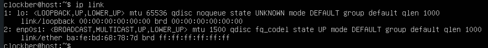

## Part 1. Установка ОС
- 
_Отображает версию ОС_

## Part 2. Создание пользователя
- 
_Создание нового пользователя и добавление его в группу 'adm'_

## Part 3. Настройка сети ОС
- 
_Задача имя машины вида user-1 и установка временной зоны в соответсвии с текущим местоположением_

- 
_Вывод названий сетевых интерфейсов_
- lo (loopback device) – виртуальный интерфейс, присутствующий по умолчанию в любом Linux. Он используется для отладки сетевых программ и запуска серверных приложений на локальной машине. С этим интерфейсом всегда связан адрес 127.0.0.1. У него есть dns-имя – localhost. Посмотреть привязку можно в файле /etc/hosts..

- 
_ip адрес устройства от DHCP сервера_
- Dynamic Host Configuration Protocol (DHCP) — сетевой протокол, предназначенный для автоматической конфигурации параметров сети на сетевых узлах.

- 
_Внутренний ip адрес шлюза_

- 
_Внешний ip адрес_

- 
_вручную задаем статичные адреса_

- Перезагрузить виртуальную машину. Убедиться, что статичные сетевые настройки (ip, gw, dns) соответствуют заданным в предыдущем пункте.

- 
- пропинговать удаленные хосты 1.1.1.1 и ya.ru

## Part 4. Обновление ОС
- 
_Обновление системных пакетов до последней версии через apt upgrade_

## Part 5. Использование команды sudo
- sudo — это утилита, предоставляющая привилегии root для выполнения административных операций в соответствии со своими настройками. Она позволяет легко контролировать доступ к важным приложениям в системе. 
- 
_предоставляем права root пользователю_
- 
_Переключаемся и проверяем права_

- 
_меняем имя хоста и проверяем_

## Part 6. Установка и настройка службы времени
- 
_Вывод timedatectl show, показывает время часового пояса._

## Part 7. Установка и использование текстовых редакторов
- Использованы редакторы Vim, Nano, Joe
_установка: usdo apt install vim_
_sudo apt install nano_
_sudo apt install joe_

_создаем файл *test_X.txt*_
- 
_1) Создание файла в vim : vim test_VIM.txt 2) Выйти c сохранениeм(esc) :wq!_
- 
_1) Создание файла в nano : nano test_NANO.txt 2) Выйти c сохранениeм ^+O, ^+X_
- 
_1) Создание файла в joe : joe test_JOE.txt 2) Выйти c сохранениeм ^K+W, ^K+Z_

- Меняем никнейм на строку "21 School 21", без сохранения

- 
_Выйти без сохранения(esc) :q!_
- 
_Выйти без сохранения ^+O_
- 
_Выйти без сохранения ^K+Z_

- Функции поиска по содержимому файла (слово)

- 
_найти что-то в файле :/clockber и заменить :%s/clockber/world/g - clockber заменяем на world_
- 
_найти что-то в файле ^K+F и заменить ^K+F: (R)eplace_
- 
_найти что-то в файле Cntr+W и заменить Cntr+W & Cntr+R_

## Part 8. Установка и базовая настройка сервиса SSHD

_Установить службу SSHd: sudo apt install openssh-server_
_Проверяем стату службы: systemctl status sshd_

- 
_автостарт службы SSHd_

- 
_Перенастроить службу SSHd на порт 2022_
_Рестарт сервиса: sudo systemctl restart ssh_

- 

- ps - выводит список текущих процессов на сервере. Флаги: -A, -e, (a) - выбрать все процессы; -a - выбрать все процессы, кроме фоновых; -d, (g) - выбрать все процессы, даже фоновые, кроме процессов сессий; -N - выбрать все процессы кроме указанных; -С - выбирать процессы по имени команды; -G - выбрать процессы по ID группы; -p, (p) - выбрать процессы PID; --ppid - выбрать процессы по PID родительского процесса; -s - выбрать процессы по ID сессии; -t, (t) - выбрать процессы по tty; -u, (U) - выбрать процессы пользователя.

- Перезагрузить систему: sudo reboot

_Установим netstat: sudo apt install net-tools_
- 
_Вывод команды netstat -tan_

- -a - Отображение всех подключений и ожидающих портов. -n - Отображение адресов и номеров портов в числовом формате. -t - Отображение текущего подключения в состоянии переноса нагрузки с процессора на сетевой адаптер при передаче данных ( "offload" ). 0.0.0.0 означает, что подключение может быть выполнено с/на любой адрес LISTEN - готовность к установке соединения

## Установка и использование утилит top, htop

- 
_Вывод комынды top_
  * uptime = 24 min
  * количество авторизованных пользователей 1
  * общая загрузка системы - load avarage
  * общее количество процессов - tasks
  * загрузка cpu - %Cpu(s)
  * загрузка памяти - MiB mem

- 
_pid процесса занимающего больше всего памяти Shift+m_

- 
_pid процесса, занимающего больше всего процессорного времени Shift+p_

- 
_Вывод htop с ссортировкой по PID, PERCENT_CPU, PERCENT_MEM, TIME_

- 
_отфильтрованному для процесса sshd_

- 
_с процессом syslog, найденным, используя поиск_

- 
_с добавленным выводом hostname, clock и uptime_

## Part 10. Использование утилиты fdisk

- 

## Part 11. Использование утилиты df

- 
_Вывод команды df /root_
  * размер раздела - 31270768
  * размер занятого пространства - 7119720
  * размер свободного пространства - 22537020
  * процент использования - 25%
  * единицa измерения в выводе - Kb

- 
_Вывод команды df -Th /root_
  * размер раздела - 30Gb
  * размер занятого пространства - 6.8Gb
  * размер свободного пространства - 22Gb
  * процент использования - 25%
  * единицa измерения в выводе - Gb

## Part 12. Использование утилиты du

- 
_Вывод команды du -h_

- 
_размер папок /home, /var, /var/log (в байтах, в человекочитаемом виде)_

## Part 13. Установка и использование утилиты ncdu
_Установка: sudo apt install ncdu_

- 
_размер /home_

- 
_размер /var_

- 
_размер /var/log_

## Part 14. Работа с системными журналами
- 
_просмотр less /var/log/dmesg_

- 
_просмотр less /var/log/syslog_

- 
_просмотр less /var/log/auth.log_

- 
_время последней успешной авторизации, имя пользователя и метод входа в систему._

- 
_перезапуск sshd service ssh restart_

## Part 15. Использование планировщика заданий CRON

- 
_с помощью команды crontab -e задаем задачу что бы каждые 2 минуты выполнялся скрипт_

- 
_смотрим в логах записи /var/log/syslog_

- 
_список текущих заданий, а затем их удаление_